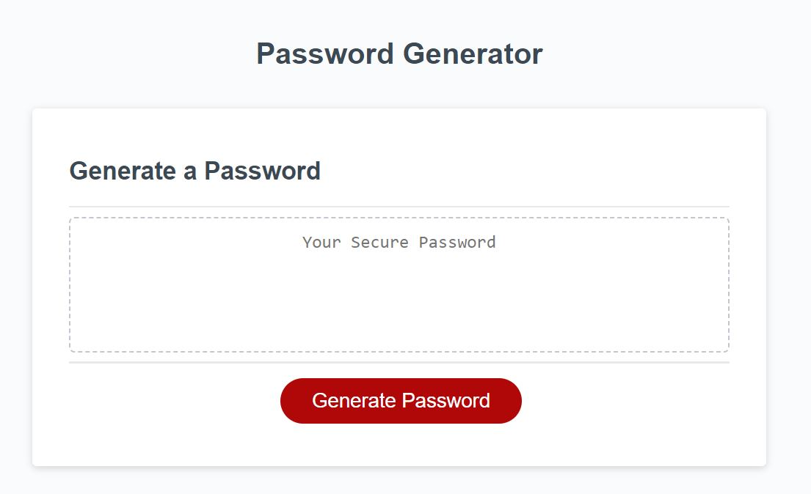
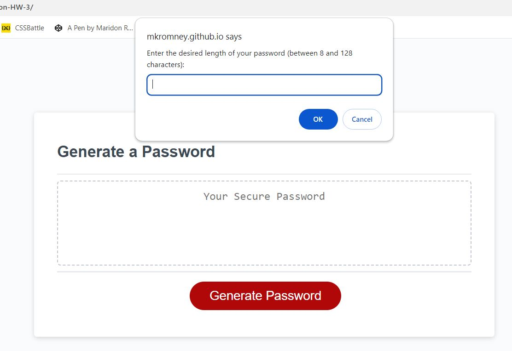
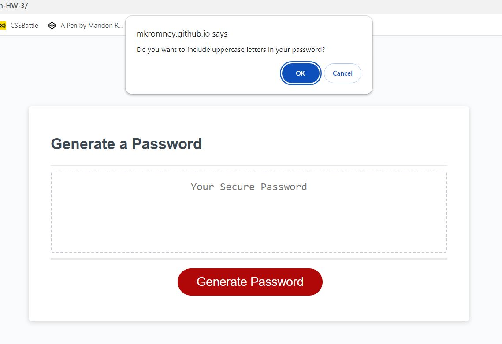
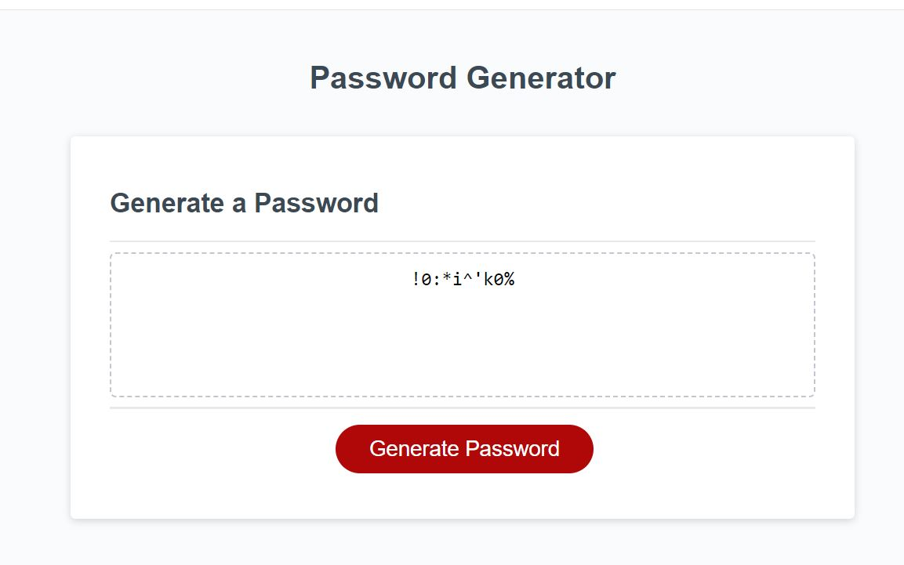

**Maridon's Password Generator Readme**

## Description

 This webpage is an exercise in JavaScript. It is a password generator that asks a user for several prompts in order to generate a password that meets selected parameters. Parameters included a user's choice of password length between 8 and 128 characters, whether or not to include uppercase letters, lowercase letters, numbers and/or special characters. The website begins password generation when a user clicks the red "generate password" button and interacts with the prompts that appear. Once the user has cycled through all prompts a password is generated and appears in the central box element. 

Link to & Preview of my WebPage:

https://mkromney.github.io/Maridon-HW-3/

These screenshots show the website in action. 
 

## Features

This homework has several main features, a "Generate Password" button that initiates lines of code which prompt a user to then use a second feature, pop-up boxes that allow the user to make a set of criteria selections with which to generate a password. A final feature of this page is that the password generates in a clearly-indicated box on the page with a generated password that matches the selected criteria.

## Credits

There were many credits for this webpage, most of which are indicated on each relevant line of code in the .js file. Primarily my resources were composed of web-based sources from which I was able to borrow specific lines of code that I adapted to my needs. Among there were: Mozilla.org, Google.com, and blog.simplifiedweb.com. 

Thank you for reading!